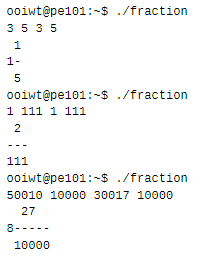

# PE Cheatsheet

<details>

<summary>Typecasting</summary>

```c
cs1010_print_double((double)mcneal*100.0/(double)total);
```


</details>

<details>

<summary>Comparing double variable to number</summary>

<pre class="language-c"><code class="lang-c">while (fabs(fx) >= 0.000000001) {
    double fpx = fp(a, b, c, x);
<strong>    x = fx/fpx;
</strong>    fx = f(a, b, c, d, x);
}
</code></pre>

</details>

<details>

<summary>is_prime Algo</summary>

```c
bool is_prime(long n)
{
    if (n < 2){
        return false;
    }
    for (int i = 2; i * i <= n; i += 1) {
        if (n % i == 0) {
            return false;
        }
    }
    return true;
}
```

</details>

<details>

<summary>Find Longest Consecutive Digit From Digit Sequence</summary>

<pre class="language-c"><code class="lang-c">long longest_count = 1 ;
long longest_digit;
long current_count = 0;
long current_digit = n % 10;

do {
// Increase the counter if we see the same digit.
// Otherwise reset counter to 1.
    if (n % 10 == current_digit) {
<strong>        current_count += 1;
</strong>    } else {
        current_count = 1;
    }
    // Checks if we find a longer (or equally long)
    // consecutive sequence. Update longest_digit
    // and longest_count if so.
    if (current_count > longest_count) {
        longest_digit = current_digit;
        longest_count = current_count;
    } else if (current_count == longest_count) {
        if (current_digit &#x3C; longest_digit) {
            longest_digit = current_digit;
        }
    }
    
    // Update the current digit to the last digit of n
    // and shorten n by one digit.
    current_digit = n % 10;
    n = n / 10;
} while (n > 0);
return longest_digit;
}
</code></pre>


</details>

<details>

<summary>Draw Square</summary>

.png>)

```c
void print_line(long width) {
    for (long i = 0; i < width; i+=1) {
        cs1010_print_string("#");
    }
}

void print_border(long width) {
    cs1010_print_string("#");
    for (long i = 0; i < width 2; i+=1) {
        cs1010_print_string(" ");
    }
    cs1010_print_string("#");
}

void print_square(long row, long width) {
    if (width == 1) {
        cs1010_print_string("#");
    } else if (row == 0 || row == width 1) {
        print_line(width);
    } else if (row == 1 || row == width 2) {
        print_border(width);
    } else {
        cs1010_print_string("# ");
        print_square(row 2, width 4);
        cs1010_print_string(" #");
    }
}

int main()
{
    long width = cs1010_read_long();
    for (long row = 0; row < width; row += 1) {
    print_square(row, width);
    cs1010_println_string("");
    }
}


```

</details>

<details>

<summary>Reverse Digit Recursively</summary>

```c
long num_of_digits(long n){
  if (n < 10){
    return 1;
  }
  return 1 + num_of_digits(n / 10);
}

long pow10(long k){
  if (k == 0){
    return 1;
  }
  return 10 * pow10(k - 1);
}

long reverse(long n, long digits){
  if (digits == 1){
    return n;
  }
  return (n % 10) * pow10(digits - 1) + reverse(n / 10, digits - 1);
}

long output = reverse(n, num_of_digits(n));
```

Reasoning:

* Assume by wishful thinking that the rest of the digits are reversed already
* To reverse the last digit (add it to the front):
  * Obtain the last digit (n%10)
  * Multiply last digit with num of digits (pow10 function)
  * Add last digit to the reversed digits

</details>

<details>

<summary>Prime Factorization</summary>

```c
long curr = n;
if (is_prime(curr)) {
  print(curr, 1);
    return;
}
for (long factor = 2; factor <= sqrt(curr) && curr != 1; factor += 1) { // <changed here
  if (is_prime(factor)) {
    long count = 0;
      while (curr % factor == 0) {
        curr = curr / factor;
          count += 1;
      }
    if (count != 0) {
      print(factor, count);
    }
    if (is_prime(curr) && curr != 1) {
      print(curr, 1);
        return;
    }
  }
}
```

* Rationale:
  * if number is prime --> don't need check for factors --> just output
  * Check for prime factors up till sqrt(curr) only or if curr is already == 1

</details>

<details>

<summary>Insert Digit based on Index Recursively</summary>

```c
long insert(long N, long d, long k){
  if (k == 1){
    return N * 10 + d;
  }
  return insert(N / 10, d, k - 1) * 10 + (N % 10);
}

#In Main to deal with negative numbers
  if (N >= 0){
   answer = insert(N, d, k);
  }
  else {
    answer = -insert(-N, d, k);
  }
```

* Base case
  * When the index to insert is 1 --> the number is \* 10 and added with the insertion number
* Solving sub-problem
  * insert the shorter number (number / 10) with index (k-1)

</details>

<details>

<summary>GCD</summary>

```c
long gcd(long a, long b) {
  if (b == 0) {
    return a;
  }
  return gcd(b, a % b);
}

```

* Euclidean Algorithm

</details>

<details>

<summary>Simple Digits</summary>

```c
long simplify(long n) {
  if (n / 10 == 0) {
    // one digit remaining
    return n;
  }
  if ((n / 10) % 10 == n % 10) {
    // last two digits are the same
    return simplify(n / 10);
  }
  // last two digits are different
  return simplify(n / 10) * 10 + (n % 10);
}
```

</details>

<details>

<summary>Print Characters k times</summary>

* Useful for drawing patterns

```c
void print_k_times(long times, char c) {
    for (long i = 0; i < times; i++) {
        putchar(c);
    }
}
```

</details>

<details>

<summary>Aligning fraction</summary>

```c
long ilen;
if (whole == 0) {
  ilen = 0;
} else {
  ilen = count_digits(whole);
}
long nlen = count_digits(numerator);
long dlen = count_digits(denominator);
print_k_times(ilen + (dlen nlen)/2, ' ');
cs1010_println_long(numerator);
if (whole != 0) {

  cs1010_print_long(whole);
}
print_k_times(dlen, ' ');
cs1010_println_string("");
print_k_times(ilen, ' ');
cs1010_println_long(denominator);
```



</details>

<details>

<summary>Convert Double to Long</summary>

```c
long numerator = (long)(round(num * 10));
```

</details>

<details>

<summary>Ceiling Function for Long</summary>

```c
  double num = ceil((double)distance / (double)1000);
  long segments = (long)(round(num));
```

</details>

<details>

<summary>Rearranging digits to have largest</summary>

```c
long insert(long n, long digit)
{
  if (n % 10 > digit) {
    return n * 10 + digit;
  }
  if (n == 0) {
    return digit;
  }
  return (insert(n / 10, digit) * 10) + (n % 10);
}
long largest(long n)
{
  if (n < 10) {
    return n;
  }
  return insert(largest(n / 10), n % 10);
}
```

* For example, the largest possible number we get by rearranging the digits in 6752378 is 8776532. The largest possible number we get by rearranging the digits in -1010 is -11
* For negative numbers, we need to rearrange the digits in reverse order.

</details>
